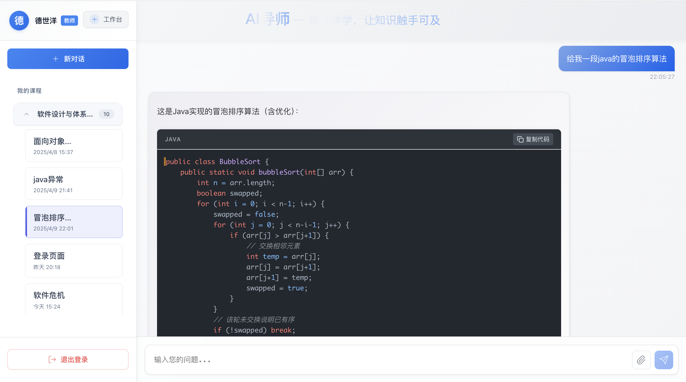

# AI导师系统

<p align="center">
  
</p>

<h1 align="center" style="margin: 30px 0 30px; font-weight: bold;">AI导师 - 智能教育支持系统</h1>
<h4 align="center">基于RuoYi-Vue + Ollama + Dify的AI教育支持系统</h4>

<p align="center">
  <a href="https://gitee.com/chi-hao0806/deepseek"></a>
  <a href="#"></a>
  <a href="#"></a>
  <a href="#"></a>
</p>

## 📚 项目简介

AI导师是一款智能化教育支持系统，通过整合多模态数据分析与知识图谱技术，构建与课堂教学内容高度匹配的智能问答引擎，实现对学生个性化问题的高精度响应。系统深度融合学科知识体系与认知规律，突破传统被动学习瓶颈，推动"教师主导+AI辅助"的协同教学模式落地。

<p align="center">
  
</p>

## 🔥 核心特性

* **Agent工作链路**：教师一键生成练习题、考试题，减轻备课负担
* **多租户架构**：从学院角度实现数据隔离，保障数据安全与隐私
* **AI精准伴学**：基于大模型的智能问答，降低学习门槛
* **实时学情追踪**：动态分析学生提问情况、学习进度，创建学生画像
* **课程精细管理**：教师可新建课程并添加学生，实现精准教学
* **知识库定制**：支持领域知识定制，提升回答精准度

## 💡 技术架构

### 前端技术

* Vue 2.x (后台管理系统)
* Vue 3.x (用户端)
* Element UI/Element Plus
* Axios 请求库
* ECharts 数据可视化

### 后端技术

* Spring Boot 2.7.x
* Spring Security 安全框架
* MyBatis ORM框架
* Redis 缓存
* JWT 认证
* MySQL 数据库

### AI技术

* Ollama 本地大语言模型部署
* Dify AI应用开发平台
* 知识图谱与RAG检索增强
* 多模态数据处理

## 🚀 功能模块

### 教师端

1. **智能问答**
   基于NLP技术和深度学习算法，精准理解教师提出的专业问题，提供高匹配度的知识解答。

   <p align="center">
     
   </p>

2. **课程管理**
   灵活调度和管理教学资源，高效组织教学内容，支持实时更新和多终端同步。

   <p align="center">
     
   </p>

3. **知识库管理**
   利用机器学习与智能分类技术，高效管理和维护知识库内容，支持知识点的增补、修订和优化。

   <p align="center">
     
   </p>

4. **学生管理**
   集成学情数据分析和行为分析算法，监控学生学习行为、进度及参与度，生成动态学习报告。

   <p align="center">
     
   </p>

5. **学情分析**
   挖掘学生学习模式、偏好和难点，自动生成学情诊断报告，支持精准化教学干预。

   <p align="center">
     
   </p>

6. **学生学情画像**
   结合多维度学习数据构建个性化学情画像，可视化呈现学习状况、知识掌握程度和薄弱环节。


### 学生端

1. **智能问答**
   采用先进的NLP技术，结合知识图谱和深度神经网络，高效理解学术问题并提供针对性解答。


2. **历史会话管理**
   记录与AI导师的每次交互，支持回溯、复习和查阅学习记录，避免信息遗忘和重复学习。

## 🔮 未来规划

### 智能课堂互动模块

实时分析学生课堂讨论数据，动态生成引导性问题，激发深度思辨与跨学科思维。适用于"科技与伦理"等通识课程，通过结构化引导促进批判性思维培养。

### 辅助教师生成教学内容

利用生成式AI技术，协助教师快速生成课件、讲义与跨学科教学案例，基于知识图谱生成多学科视角的综合内容，提升课堂吸引力。

### 自动化出题与批阅

通过NLP与自动评估算法，生成多样化试题并支持开放性作业的自动批阅，减轻教师负担，提供个性化反馈机制。

### AI生成跨学科教学资源库

利用生成式AI与知识图谱，构建多模态跨学科资源库，支持资源的动态更新与定期爬取，确保内容时效性。

### 自动化学术写作指导工具

为学生提供论文结构优化、文献推荐与语言润色支持，通过知识图谱推荐跨学科参考文献，提升学术写作能力。

## 🏆 项目优势

### 自研管理系统，精准匹配教育场景

基于大模型技术框架构建核心引擎，自主研发智能交互系统与知识管理平台，确保高效的师生交互和问题响应。

### 分层级定制开发，适配多元教育需求

支持学科知识体系模块化配置，灵活调整学习路径与推荐策略，提供个性化的分层教学服务。

### 动态进化系统架构，保障持续服务能力

采用增量式知识更新架构和大模型微调框架，支持实时更新和动态优化，保持知识前沿性。

## 📦 部署方式

### 本地化部署（不含硬件）

提供本地化部署服务，客户可根据需求部署到本地服务器或云环境，确保数据安全性和系统稳定性。

1. 克隆项目

```bash
git clone https://gitee.com/chi-hao0806/deep-seek.git
```

2. 配置环境

```bash
# 后端环境要求
JDK >= 1.8
MySQL >= 5.7
Redis >= 5.0

# 前端环境要求
Node.js >= 12.0
```

3. 启动服务

```bash
# 后端启动
cd ruoyi-admin
mvn spring-boot:run

# 前端启动
cd ruoyi-ui
npm install
npm run dev
```

### 开通账号直接使用

提供云端SaaS服务，用户通过开通账号直接使用系统，无需本地部署硬件。系统具备灵活的权限设置和数据同步功能，简化管理流程，降低IT运维成本。

## 📊 系统演示

<table>
    <tr>
        <td></td>
        <td></td>
    </tr>
    <tr>
        <td></td>
        <td></td>
    </tr>
    <tr>
        <td></td>
        <td></td>
    </tr>
    <tr>
        <td></td>
        <td></td>
    </tr>
</table>

## 📝 背景与意义

### 现状背景

1. **被动学习与信息筛选困境**：学生因畏惧提问导致学习质量下滑，同时面临内容碎片化与知识筛选挑战
2. **人工智能+教育战略深化**：政策层面推动AI与教育融合，构建AI助教、助学场景
3. **AI趋势下的人才培养需求**：培养"人机协同"思维与跨学科整合能力，提升学习者数字素养

### 项目目标

构建智能化AI导师系统，突破传统被动学习瓶颈，通过智能诊断、精准推荐及交互式学习路径规划，推动"教师主导+AI辅助"的协同教学模式落地，为培养智能时代所需的复合型人才提供支持。

## 📃 许可证

[MIT License](LICENSE)

## 💬 联系我们

* Email: [tyroch@163.com](mailto:tyroch@163.com)
* 项目地址: [https://gitee.com/chi-hao0806/deep-seek](https://gitee.com/chi-hao0806/deep-seek)
* 后端项目: [https://gitee.com/chi-hao0806/deep-seek](https://gitee.com/chi-hao0806/deep-seek)
    <p align="center">
     
   </p>
---

<p align="center">AI导师 - 让知识触手可及</p>
